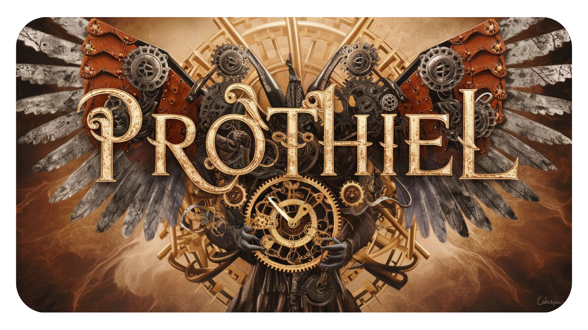

 
<h1 align="center">Prothiel</h1>
<h2 align="center">
  ～AI Harmony, Infinite Possibilities～

   

</h2>

>[!IMPORTANT]
>このリポジトリは[SourceSage](https://github.com/Sunwood-ai-labs/SourceSage)を活用しており、リリースノートやREADME、コミットメッセージの9割は[SourceSage](https://github.com/Sunwood-ai-labs/SourceSage) ＋ [claude.ai](https://claude.ai/)で生成しています。

## 🌟 Introduction

## 🚀 Getting Started

conda create -n prothel python=3.11

conda activate prothel

pip install art